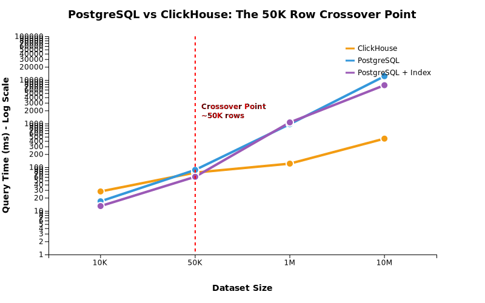

# PostgreSQL vs ClickHouse: What I Learned From My First Database Benchmark

My first query against 10 million rows in ClickHouse took 4,191 milliseconds. My last took 75. The difference wasn't a new server or additional memory—it was a single line that taught me a lot about how columnar databases work.

Working at [a company that builds open source OLAP tools](https://docs.fiveonefour.com/moose) means I hear about ClickHouse performance daily. Everyone talks about how much faster it is than traditional databases for analytics. But as a product manager, I've learned there's a difference between hearing about something and actually understanding it.

So I built this benchmark with a specific question in mind: **How would an AI agent query these databases during a conversation?** I wanted to understand not just that ClickHouse is faster for analytics, but when it matters, why it works, and what the code actually looks like when you're trying to make it perform.

## Table of Contents

- [Methodology](#how-i-tested-this)
- [Query pattern](#the-workload-llm-style-data-exploration)
- [Results](#the-results-50k-row-crossover-point--clickhouse-starts-to-be-meaningfully-better-at-1m-rows)
- [Learning #1: ORDER BY = Physical Storage (Not Just Sorting)](#learning-1-order-by--physical-storage-not-just-sorting)
- [Learning #2: Bulk Loading Architectures Differ Completely](#learning-2-bulk-loading-architectures-differ-completely)
- [Learning #3: Type Precision Affects Performance Differently](#learning-3-type-precision-affects-performance-differently)
- [Learning #4: Native Functions vs Standard SQL](#learning-4-native-functions-vs-standard-sql)
- [Learning #5: NULL Handling Philosophy](#learning-5-null-handling-philosophy)
- [The LLM Advantage](#the-llm-advantage)
- [Conclusion](#conclusion)

## How I Tested This

To make the comparison fair, I set up PostgreSQL and ClickHouse on identical Docker containers—each with 4GB RAM and 2 CPUs on my M3 Pro. The dataset was 46 columns of aircraft tracking data, ranging from 10,000 to 10 million records. Every test ran 100 iterations with proper cache warmup to ensure I wasn't measuring random fluctuations.

The workload itself was designed to simulate how an AI agent might progressively explore unfamiliar data: first discovering the schema, then sampling records, followed by time-bucketed aggregations, and finally statistical calculations. This felt more realistic than running isolated queries—it's how conversations with data actually unfold.

*You can find the full methodology and reproducible setup in [BENCHMARK_METHODOLOGY.md](BENCHMARK_METHODOLOGY.md) if you want to run this yourself.*

## The Workload: LLM-Style Data Exploration

Here's what a typical AI-assisted data exploration looks like. Imagine asking Claude: *"Help me understand this aircraft tracking dataset"*

**Claude would naturally progress through these queries:**

```sql
-- Q1: "What tables do we have?"
SHOW TABLES;

-- Q2: "Show me what the data looks like"
SELECT * FROM performance_test LIMIT 10;

-- Q3: "How many unique aircraft do we see each hour?"
SELECT 
  toStartOfHour(timestamp) AS hour,
  uniq(hex) AS unique_aircraft_count
FROM performance_test 
WHERE timestamp >= '2025-01-01'
GROUP BY hour
ORDER BY hour;

-- Q4: "What's the average altitude during those periods?"
SELECT 
  toStartOfHour(timestamp) AS hour,
  uniq(hex) AS unique_aircraft_count,
  avg(alt_baro) AS avg_altitude
FROM performance_test 
WHERE timestamp >= '2025-01-01'
  AND alt_baro_is_ground = 0
GROUP BY hour
ORDER BY hour;
```

This progression from schema discovery → sampling → aggregation → statistical analysis mirrors how developers actually explore unfamiliar data with AI assistance.

## The Results: 50K Row Crossover Point / ClickHouse starts to be meaningfully better at 1M rows

Note, this is based on the query pattern and hardware of my benchmark, but you can run the benchmark yourself to find your "crossover point".



| Dataset Size | ClickHouse | PostgreSQL | PG+Index | Winner |
|--------------|------------|------------|----------|--------|
| **10K**      | 27.9ms     | 16.6ms     | 12.9ms   | PG+Idx (2.2x) |
| **50K**      | 75.5ms     | 87.0ms     | 60.5ms   | ~Equal |
| **1M**       | 121.1ms    | 974.1ms    | 1,067ms  | CH (8.8x) |
| **10M**      | 453ms      | 12,201ms   | 7,595ms  | **CH (16.8x)** |

*Times represent the full 4-query analytical workload: schema discovery, data sampling, aggregation, and statistical calculation.*

**Key insight**: PostgreSQL is faster on small datasets (lower overhead). ClickHouse is faster once columnar benefits outweigh setup costs.

## Learning #1: ORDER BY = Physical Storage (Not Just Sorting)

This was my biggest "aha!" moment, and it perfectly illustrates why understanding database internals matters. (Turns out I should have [RTFMed](https://clickhouse.com/docs/engines/table-engines/mergetree-family/mergetree)).

### The Disaster: My First Schema

I approached ClickHouse like PostgreSQL. "Let's store data chronologically," I thought:

```sql
-- My naive ClickHouse schema (commit 710212a)
CREATE TABLE performance_test (
  timestamp DateTime,
  hex String,
  alt_baro Int32,
  alt_baro_is_ground UInt8,
  -- ... 42 more columns
) ENGINE = MergeTree()
ORDER BY (timestamp, hex);  -- "Logical" chronological order
```

When I ran my analytical query, my results weren't as performant as I wanted:

```sql
-- The query that took 4,191ms
SELECT 
  toStartOfHour(timestamp) AS hour,
  uniq(hex) AS unique_aircraft_count,
  avg(alt_baro) AS avg_altitude
FROM performance_test 
WHERE alt_baro_is_ground = 0  -- Filter out ground readings
  AND timestamp >= '2025-01-01'
GROUP BY hour;
```

**4,191 milliseconds.** For 10 million rows, that's painful.

### The Schema Fix

I asked Nico (my mate and our CTO—he's patient with my curiosity) about the slow query performance: *"ClickHouse query taking 4+ seconds on 10M rows. Schema and query attached - what's wrong?"*

**"Your ORDER BY doesn't match your query pattern. You're filtering on whether the aircraft is on the ground but it's not first in your primary key. ClickHouse has to scan the entire dataset to find those planes."**

The fix was embarrassingly simple:

```sql
-- The corrected schema (commit 8924b53)  
CREATE TABLE performance_test (
  -- Same columns...
) ENGINE = MergeTree()
ORDER BY (alt_baro_is_ground, hex, timestamp);  -- Filter column FIRST
```

**Same query, same data: 75ms.** A **55x improvement** from changing one line.

### Why This Matters: Physical vs Logical Storage

Here's the fundamental difference I missed:

**PostgreSQL approach (what I did wrong):**
```sql
-- ORDER BY is just for output sorting
SELECT * FROM table ORDER BY timestamp;

-- Indexes are separate from storage order
CREATE INDEX idx_filter ON table(alt_baro_is_ground);
CREATE INDEX idx_composite ON table(alt_baro_is_ground, timestamp);
```

**ClickHouse reality (what I learned):**
```sql
-- ORDER BY defines PHYSICAL storage on disk
ORDER BY (alt_baro_is_ground, hex, timestamp);

-- This means:
-- 1. All alt_baro_is_ground=0 rows stored together
-- 2. Within each group, hex values clustered  
-- 3. Query performance depends ENTIRELY on this choice
```

### The Visual Difference

**Bad ORDER BY (timestamp, hex):**
```
Disk blocks: [mixed data][mixed data][mixed data][mixed data]
Query needs: Scan ALL blocks to find alt_baro_is_ground=0
```

**Good ORDER BY (alt_baro_is_ground, hex, timestamp):**
```
Disk blocks: [ground=1][ground=1][ground=0][ground=0][ground=0]
Query needs: Skip first blocks, read only [ground=0] blocks
```

### The Trade-off: Flexibility vs Performance

This revealed a fundamental architectural difference:

> **PostgreSQL philosophy:** "I don't know what queries you'll run, so I'll create multiple indexes to handle various patterns."
> - ✅ Flexible: handles any query pattern reasonably well
> - ❌ Storage overhead: indexes take space and slow inserts
> - ❌ Not optimal: rarely the fastest for any specific pattern

> **ClickHouse philosophy:** "Tell me your primary query pattern upfront, and I'll organize everything for maximum speed."
> - ✅ Blazing fast: optimal performance for the chosen pattern  
> - ❌ Commitment required: hard to change after data is loaded

### Memory Implications

When I tested this with reduced memory (2GB vs 4GB), the ORDER BY choice became even more critical. ClickHouse failed completely during bulk inserts at 2GB - it needs substantial memory to sort and compress data during loading. But once loaded, queries ran efficiently at any memory level.

*This wasn't optimization - this was fixing a fundamentally wrongly designed OLAP schema.*

## Learning #2: Bulk Loading Architectures Differ Completely

Nothing taught me more about database architecture than trying to load 10 million records efficiently. What started as a simple task became a deep dive into how these systems handle data differently.

### The Performance Journey

**Phase 1: Individual inserts**
```javascript
for (const record of records) {
  await client.query('INSERT INTO table VALUES (...)', record);
}
```
*Projected time: 7.5 hours for 10M records*

**Phase 2: Basic batching (size: 100)**
*Result: 80 minutes*

**Phase 3: Parameter limit optimization**
I asked Claude: *"What's the optimal PostgreSQL batch size for 46 columns?"*
**"PostgreSQL's parameter limit is 65,535. You can batch ~1,400 records instead of 100."**
*Result: 30 minutes*

**Phase 4: Parallel workers**
*Result: 18 minutes (25x improvement from Phase 1)*

### Postgres performance improvement
```
PG Phase 1: [████████████████████████████████] 7.5 hours
PG Phase 2: [████████████████] 80 minutes  
PG Phase 3: [██████] 30 minutes
PG Phase 4: [██] 18 minutes ← PostgreSQL winner
```

### Bulk inserts in ClickHouse

Here's where things got interesting. When I applied the same parallel worker approach to ClickHouse:

```javascript
// Same parallel approach for ClickHouse
// Expected: Major speedup
// Actual result: Minimal improvement (57.3K → 54.8K records/sec)
```

**Why?** ClickHouse's columnar engine is already internally optimized for bulk operations. Adding client-side parallelism actually created overhead rather than improvement. Again, a cool learning for me, but [probably should have read the docs](https://clickhouse.com/docs/best-practices/selecting-an-insert-strategy): "We recommend inserting data in batches of at least 1,000 rows, and ideally between 10,000–100,000 rows. Fewer, larger inserts reduce the number of parts written, minimize merge load, and lower overall system resource usage.".

### The Architecture Revelation

This experience revealed a fundamental difference in how these systems handle concurrency:

**🟦 PostgreSQL (OLTP) Philosophy:**
```
Client parallelism = Performance
┌─────────┐    ┌─────────────┐
│Worker 1 │───▶│             │
├─────────┤    │             │
│Worker 2 │───▶│ PostgreSQL  │
├─────────┤    │             │  
│Worker 3 │───▶│             │
├─────────┤    │             │
│Worker 4 │───▶│             │
└─────────┘    └─────────────┘
"I'll handle multiple connections efficiently"
```

**🟨 ClickHouse (OLAP) Philosophy:**
```
Engine parallelism = Performance  
┌─────────┐    ┌─────────────┐
│ Client  │───▶│   Internal  │
└─────────┘    │ Parallel    │
               │ Processing  │
               └─────────────┘
"Send me data, I'll parallelize internally"
```

**The lesson:** OLTP databases benefit from client-side parallelism because they're designed for concurrent operations. OLAP databases are already internally parallelized for the operations they're optimized for.

### Relative Performance
```
PG Phase 1: [████████████████████████████████] 7.5 hours
PG Phase 2: [████████████████] 80 minutes  
PG Phase 3: [██████] 30 minutes
PG Phase 4: [██] 18 minutes ← PostgreSQL winner

ClickHouse: [█] 13 minutes (single-threaded optimal)
```

## Learning #3: Type Precision Affects Performance Differently

ClickHouse performance depends heavily on using precise types. PostgreSQL is more forgiving.

### Initial Schema: Generic Types

I started with generic types in both databases:

```sql
-- PostgreSQL schema
CREATE TABLE performance_test (
  lat DOUBLE PRECISION,
  alt_baro DOUBLE PRECISION,  
  hex VARCHAR(6),
  approach BOOLEAN,
  transponder_type VARCHAR(50)
);

-- ClickHouse schema (initial)
CREATE TABLE performance_test (
  lat Float64,
  alt_baro Int32,
  hex String,              -- Variable-length string
  approach UInt8,
  transponder_type String  -- Variable-length string
) ENGINE = MergeTree()
ORDER BY (alt_baro_is_ground, hex, timestamp);
```

### LLM-Optimized Schema

Usually, I wouldn't have gone further, not bothering to optimize the types for the labor cost. But now, I can give Claude Code or Cursor (with almost any LLM) a code sample and [a link to the ClickHouse type documentation](https://clickhouse.com/docs/knowledgebase/tips-tricks-optimizing-basic-data-types-in-clickhouse), and ask for it to regenerate the `CREATE TABLE` statement for efficiency: *"How should I optimize ClickHouse types for this aircraft tracking schema?"*

```sql
-- ClickHouse schema (optimized)
CREATE TABLE performance_test (
  lat Float64,                             -- Sufficient precision
  alt_baro Int32,                          -- 32-bit range adequate
  hex FixedString(6),                      -- Always exactly 6 characters
  approach UInt8,                          -- 1 byte boolean
  transponder_type LowCardinality(String)  -- Dictionary encoding for ~20 unique values
) ENGINE = MergeTree()
ORDER BY (alt_baro_is_ground, hex, timestamp);
```

### Performance Impact

Testing with 5M records:

**Storage:**
- Generic types: 2.1 GB
- Optimized types: 1.8 GB (15% reduction)

**Query performance:**
- Generic types: 127ms average
- Optimized types: 109ms average (10-15% improvement)

### Why This Works

**ClickHouse columnar storage benefits:**
```
FixedString(6) vs String:
┌─────────────┬─────────────┐
│FixedString  │   String    │
├─────────────┼─────────────┤
│ ABC123      │ 3ABC123     │ ← Length prefix overhead
│ DEF456      │ 3DEF456     │
│ GHI789      │ 3GHI789     │
└─────────────┴─────────────┘
Better compression, faster scanning
```

**LowCardinality optimization:**
```
Regular String column:
┌──────────────┬──────────────┬──────────────┐
│  "adsb_icao" │  "adsb_icao" │  "mode_s"    │ ← Repeated values
└──────────────┴──────────────┴──────────────┘

LowCardinality(String):
┌─────┬─────┬─────┐     Dictionary: 0="adsb_icao", 1="mode_s"
│  0  │  0  │  1  │ ← Reference to dictionary
└─────┴─────┴─────┘
```

**Result:** LLMs remove the expertise barrier for database-specific optimizations without sacrificing performance.

## Learning #4: Native Functions vs Standard SQL

Database-specific functions often perform significantly better than generic SQL. Again, these weren't all ClickHouse functions that I knew beforehand, but they were optimizations that were easily made by a copilot, and explained clearly.

### Unique Count Comparison

Testing unique aircraft count on 5M records:

**PostgreSQL (exact count):**
```sql
SELECT COUNT(DISTINCT hex) FROM performance_test;
-- Result: 4,847 aircraft (exact)
-- Time: 2,606ms
```
*Documentation: [PostgreSQL Aggregate Functions](https://www.postgresql.org/docs/current/functions-aggregate.html)*

**ClickHouse (approximate count):**
```sql  
SELECT uniq(hex) FROM performance_test;
-- Result: 4,851 aircraft (0.08% error)
-- Time: 61ms (40x faster)
```
*Documentation: [ClickHouse uniq() Function](https://clickhouse.com/docs/en/sql-reference/aggregate-functions/reference/uniq)*

### Date Function Comparison

**PostgreSQL:**
```sql
SELECT date_trunc('hour', timestamp), COUNT(*) 
FROM performance_test 
GROUP BY date_trunc('hour', timestamp);
-- Standard SQL function
```

**ClickHouse:**
```sql
SELECT toStartOfHour(timestamp), COUNT(*)
FROM performance_test 
GROUP BY toStartOfHour(timestamp);
-- Native function, 20-30% faster
```

### The Accuracy vs Speed Trade-off

**ClickHouse approximation algorithms:**
```
uniq() - HyperLogLog algorithm
├── Speed: Very fast
├── Memory: Low (fixed size)  
└── Accuracy: 99%+ for most data

uniqExact() - Exact counting
├── Speed: Slower (similar to PostgreSQL)
├── Memory: High (grows with cardinality)
└── Accuracy: 100%
```

**Result:** Native functions provide measurable performance gains, and LLMs make them discoverable without deep database expertise.

## Learning #5: NULL Handling Philosophy

OLAP and OLTP databases handle missing data differently by design. I know this is a key philosophical / architectural difference, but I certainly didn't know that 6 days ago.

### Schema Design Differences

**ClickHouse approach (performance-first):**
```sql
CREATE TABLE performance_test (
  nav_qnh UInt16 DEFAULT 0,           -- Missing data = 0
  nav_altitude_mcp UInt16 DEFAULT 0,  -- Missing data = 0
  nav_heading UInt16 DEFAULT 0        -- Missing data = 0
) ENGINE = MergeTree()
ORDER BY (alt_baro_is_ground, hex, timestamp);
```

**PostgreSQL approach (semantics-first):**
```sql
CREATE TABLE performance_test (
  nav_qnh DOUBLE PRECISION,           -- Missing data = NULL
  nav_altitude_mcp DOUBLE PRECISION,  -- Missing data = NULL
  nav_heading DOUBLE PRECISION        -- Missing data = NULL
);
```

### Query Result Differences

Same dataset, different results:

```sql
-- Test data: [1, 2, missing_value, 4]

-- PostgreSQL query
SELECT AVG(nav_qnh) FROM performance_test;
-- Result: 2.33 (excludes NULL from calculation)
-- Logic: (1 + 2 + 4) / 3 = 2.33

-- ClickHouse query  
SELECT AVG(nav_qnh) FROM performance_test;
-- Result: 1.75 (includes zero in calculation)
-- Logic: (1 + 2 + 0 + 4) / 4 = 1.75
```

### Why ClickHouse Uses Default Values

**Performance benefits:**
```
NULL column storage:
┌─────────────┬─────────────┐
│    Data     │   NULL Map  │ ← Additional bitmap overhead
├─────────────┼─────────────┤
│     1       │      0      │
│     2       │      0      │
│    NULL     │      1      │
│     4       │      0      │
└─────────────┴─────────────┘

Default value storage:
┌─────────────┐
│    Data     │ ← No additional overhead
├─────────────┤
│     1       │
│     2       │
│     0       │
│     4       │
└─────────────┘
```

**Compression efficiency:**
- Columns with default values compress better
- No NULL checking in aggregate functions
- Vectorized operations run faster

### The Trade-off

**ClickHouse:** Sacrifices semantic precision for performance and compression.
**PostgreSQL:** Preserves semantic meaning at the cost of storage and computational overhead.

**Result:** Neither approach is wrong - they optimize for different priorities.

## The LLM Advantage

**Examples from this project:**
- Schema optimization: 15% storage reduction in a single Claude Code chat
- Query fix: 55x performance improvement from a one-line copilot written code change  
- Function selection: 20-30% performance gain from native functions
- Bulk loading: 25x improvement from parameter limit knowledge

## Conclusion

Database selection traditionally required deep expertise to realize performance benefits. LLMs change this by making database-specific optimizations accessible through guided conversations rather than research projects.

**When to choose what:**
*Note, this is based on the query pattern and hardware of my benchmark, but you can run the benchmark yourself to find your "crossover point"*.

- **<50K rows:** PostgreSQL (lower overhead)
- **>50K rows:** ClickHouse for analytics (columnar benefits emerge)
- **>1M rows:** ClickHouse strongly preferred (significant performance gap)

**The practical impact:** Specialized databases like ClickHouse provide measurable performance advantages that become accessible through LLM-assisted development. The traditional expertise barrier is lowered, making OLAP systems viable for a broader range of projects.

---

**Full code and git history**: [github.com/oatsandsugar/LLM-query-test](https://github.com/oatsandsugar/LLM-query-test)
